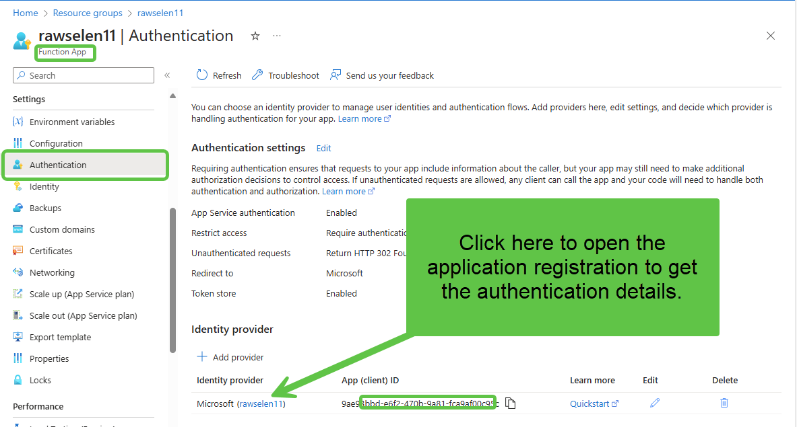

# Azure Function Calling Selenium for Interactive Login and Token Retrieval

This project contains an Azure Function that automates the process of retrieving an API JWT token required to make subsequent calls to the Scouting API. The Azure Function uses Selenium to log in interactively, obtain the login credentials, and provide them back to the caller. To get started, you can utilize the [Azure-Function-Selenium-Infrastructure-Setup](https://github.com/rwilson504/Azure-Function-Selenium-Infrastructure-Setup) project, which deploys an Azure Function using a Selenium container hosted in an Azure Container Instance (ACI).

The primary use case for this project is to log in to [Scoutbook](https://advancements.scouting.org/) and obtain a JWT token that can be used to interact with other Scouting APIs available at the following URLs:

- [https://my.scouting.org](https://my.scouting.org)
- [https://api.scouting.org](https://api.scouting.org)
- [https://advancements.scouting.org](https://advancements.scouting.org)

Since the authentication API is protected by **CORS** (Cross-Origin Resource Sharing), which restricts calls to approved hosts, we use Selenium to simulate an interactive login to get the necessary token.

Overall, this project demonstrates how to automate interactive logins when only manual sign-ins are available but programmatic access is needed.

## Limitations

Due to the use of a single standalone Selenium container, this solution is only suitable for **low-volume** use cases. High-frequency use may flood the Selenium hub with queued jobs, causing timeouts. To address this, you could deploy multiple Selenium nodes connected to a hub, but this solution does not cover that approach.

Another best practice is to run the function only when required, storing the JWT token in **Azure Key Vault**. You can then validate the token's expiration and retrieve a new one if necessary.

## Credentials

### Set BSA Credentials

You must set up your credentials by visiting [https://my.scouting.org/tools/my-account](https://my.scouting.org/tools/my-account).

### Add Secrets to Key Vault

Add your BSA credentials to **Azure Key Vault** with the following names. Ensure you have the **Key Vault Secrets Officer** role to manage secrets.

- Name: `bsa-username`
- Name: `bsa-password`

### Add Environment Variables

Add the following environment variables to the Azure Function App configuration. Replace the Key Vault URL (`https://your-keyvault-url`) with the URL of your own Key Vault instance.

- **Name**: `BSA_USERNAME`
  - **Value**: `@Microsoft.KeyVault(SecretUri=https://your-keyvault-url/secrets/bsa-username)`
- **Name**: `BSA_PASSWORD`
  - **Value**: `@Microsoft.KeyVault(SecretUri=https://your-keyvault-url/secrets/bsa-password)`

## Publish Function

You can publish the function using either the command line or Visual Studio.

```bash
func azure functionapp publish "your-function-name" --csharp
```

## Azure Functions Overview

### TestSeleniumConnection

This function serves as a health check for the Selenium setup. It navigates to **microsoft.com** and returns the page title. This ensures that the Azure Function can successfully communicate with the Selenium container.

### GetLoginData

This function logs into [https://advancements.scouting.org/login](https://advancements.scouting.org/login) and returns the local storage object for `LOGIN_DATA`, which includes the JWT token you need to access other APIs.

#### JSON Schema and Sample Output

Below is the schema and sample output for `LOGIN_DATA` returned by the `GetLoginData` function.

| Field               | Type    | Description                                  | Sample Value                                                     |
| ------------------- | ------- | -------------------------------------------- | ---------------------------------------------------------------- |
| sessionToken        | string  | Unique session identifier                    | E409E7E17284482890CE85416126467221A84FE5473D48FFABB3156892664846 |
| personGuid          | string  | Unique GUID for the person                   | 00000000-0000-0000-0000-000000000000                             |
| userGuid            | string  | Unique GUID for the user                     | 00000000-0000-0000-0000-000000000000                             |
| membership          | object  | Membership details                           |                                                                  |
| membership.memberId | integer | Member ID                                    | 1234536                                                          |
| membership.email    | string  | Email address associated with the membership | [me@mail.com](mailto\:me@mail.com)                               |
| membership.isDelete | boolean | Indicates if the membership is deleted       | false                                                            |
| account             | object  | Account details                              |                                                                  |
| account.username    | string  | Account username                             | username                                                         |
| account.userId      | integer | User ID                                      | 123456                                                           |
| profile             | object  | User profile details                         |                                                                  |
| profile.firstName   | string  | User's first name                            | John                                                             |
| profile.middleName  | string  | User's middle name (empty if none)           |                                                                  |
| profile.lastName    | string  | User's last name                             | Doe                                                              |
| profile.gender      | string  | User's gender                                | M                                                                |
| profile.dateOfBirth | string  | User's date of birth                         | 1899-01-01                                                       |
| userProfile         | null    | User profile information (if available)      | null                                                             |
| token               | string  | JWT token for API access                     | eyJsdlfkjsslkfjsdlfjksdlfjksdlfjksd...                           |
| hasMasqueradeRole   | boolean | Indicates if the user has masquerade role    | false                                                            |
| grantType           | string  | Type of grant used for authentication        | password-myst                                                    |
| isMfaSignedUp       | boolean | Indicates if the user is signed up for MFA   | false                                                            |
| mfaDeliveryMethods  | array   | MFA delivery methods                         | []                                                               |
| exp                 | integer | Expiration timestamp of the JWT              | 1728084950                                                       |

## Using the JWT Token in Power Apps

Once you have the JWT token, you can use it in **Power Automate** or **Power Apps** to make API calls to Scouting APIs.

1. **Use the Get secret action from Azure Key Vault** to retrieve the `aad-client-secret` from the Key Vault used for the Azure Function.

   

2. Use the **HTTP** action with **Active Directory OAuth** authentication to call the Azure Function. To configure this, open the Azure Function in the Azure portal, navigate to the **Authentication** section of the Azure Function, and locate the Application Registration assigned to the function app. From there, you can obtain the Tenant ID. Both the Audience and Client ID are the same as the ClientID/ApplicationId of the app. From there, you can obtain the Tenant ID. Both the Audience and Client ID are the same as the ClientID/ApplicationId of the app.   

    Open the Azure Function in the Azure Portal to find the application registration.  
      

    Get the details you need for authentication from the application registration.  
      

    Enter the authentication information for the action.  
      

4. **Get the JWT token** from the response using a **Parse JSON** action. Here�s a sample JSON schema:

   ```json
   {
       "type": "object",
       "properties": {
           "sessionToken": { "type": "string" },
           "personGuid": { "type": "string" },
           "userGuid": { "type": "string" },
           "membership": {
               "type": "object",
               "properties": {
                   "memberId": { "type": "integer" },
                   "email": { "type": "string" },
                   "isDelete": { "type": "boolean" }
               }
           },
           "account": {
               "type": "object",
               "properties": {
                   "username": { "type": "string" },
                   "userId": { "type": "integer" }
               }
           },
           "profile": {
               "type": "object",
               "properties": {
                   "firstName": { "type": "string" },
                   "middleName": { "type": "string" },
                   "lastName": { "type": "string" },
                   "gender": { "type": "string" },
                   "prefix": {},
                   "suffix": {},
                   "dateOfBirth": { "type": "string" }
               }
           },
           "userProfile": {},
           "token": { "type": "string" },
           "hasMasqueradeRole": { "type": "boolean" },
           "grantType": { "type": "string" },
           "isMfaSignedUp": { "type": "boolean" },
           "mfaDeliveryMethods": { "type": "array" },
           "exp": { "type": "integer" }
       }
   }
   ```

5. **Add an HTTP action** to call the Scouting API endpoint, such as `https://api.scouting.org/lookups/person/grades`. Use **Raw** as the **Authentication type**. Set the **Authorization** header to **Bearer** and use the JWT token obtained previously (e.g., `Bearer eyHsdlfkjsdweoriweoru...`). The token will come from the Parse JSON action created earlier.

    

### Asynchronous Call Settings in Power Automate

Ensure that the settings for calling the Azure Function are configured for the **Asynchronous** pattern. The default timeout for synchronous calls is **90 seconds**, but by using asynchronous settings, you can set a longer timeout (e.g., **5 minutes**) and also set a **retry interval** (e.g., **2 minutes**) with a **retry count** of **2**. This helps prevent queue build-ups if the Selenium container becomes overloaded.

To adjust timeout settings, you can use a tool like [Duration Checker](https://sudos.tools/iso-8601-duration-checker#:~\:text=ISO%208601%20durations%20can%20be%20useful%20for%20representing%20a%20length), which offers an easy way to write duration strings that are used in the settings.


## Conclusion

This project provides a practical solution for automating interactive logins using Selenium within Azure Functions, which is particularly useful when only manual sign-ins are available but automated access is required. By combining Azure Functions with Selenium and integrating secure credentials storage using Azure Key Vault, this setup provides a solid foundation for programmatic access to APIs that are typically restricted. However, due to the use of a single Selenium container, this setup is best suited for low-volume use cases. For higher scalability, additional considerations such as multiple Selenium nodes should be explored.